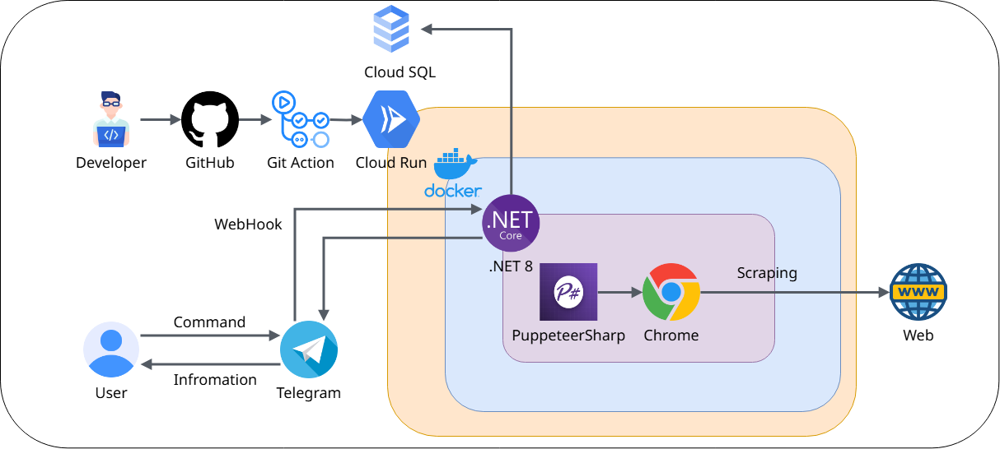

# TG 台股查詢機器人 🤖

一個基於 Telegram 的台股資訊查詢機器人，提供即時股價、K線圖表、新聞、訂閱股票資訊等功能。

## 💻 Demo (架設於免費平台，功能可能不完整)

```cmd
https://t.me/Tian_Stock_bot
```

## 🚀 快速開始

### 安裝步驟
1. Clone 專案
2. 在 `appsettings.json` 中設定您的 Telegram Bot API Key 及其他參數
3. 啟動專案
4. 呼叫SetWebHook API 傳入{BotWebhookUrl}/bot/ 例如: https://{yourdomain}/bot
5. 開始使用 !

### 🐳 Docker 部署
```bash
docker build -t [your-image-name] . --no-cache
```

## 💡 功能特色

### 🔑 核心功能
- 即時股價查詢
- 技術分析圖表
- 個股新聞追蹤
- 績效資訊查看
- 多時間週期K線圖

### 🛠️ 採用技術
- 🤖 Telegram Bot API 整合
- 🕷️ PuppeteerSharp 爬蟲技術
- ⚡  .NET 8 開發框架
- 🐳 Docker 容器化部署
- 🔄 GitHub Actions CI/CD
- ☁️ Google Cloud Run、Cloud SQL

## 🔧 系統架構



## 📖 使用指南

  *K線圖表指令*

  *📊 基本K線圖*
  格式：`/k [股票代碼] [時間範圍]`

  時間範圍選項（預設：d）：
  - `h` - 時K線
  - `d` - 日K線 
  - `w` - 週K線
  - `m` - 月K線
  - `5m` - 5分K線
  - `15m` - 15分K線
  - `30m` - 30分K線
  - `60m` - 60分K線

  *📈 TradingView K線圖*
  格式：`/c [股票代碼] [時間範圍]`

  時間範圍選項（預設：1d）：
  - `1d` - 一日
  - `5d` - 五日
  - `1m` - 一個月
  - `3m` - 三個月
  - `6m` - 六個月
  - `ytd` - 今年度
  - `1y` - 一年
  - `5y` - 五年
  - `all` - 全部時間

  *股票資訊指令*
  - `/d [股票代碼]` - 查詢股票詳細資訊
  - `/p [股票代碼]` - 查詢股票績效
  - `/n [股票代碼]` - 查詢股票新聞
  - `/yn [股票代碼]` - 查詢Yahoo股票新聞（預設：台股新聞）
  - `/i [股票代碼]` - 查詢當日收盤資訊

  *市場總覽指令*
  - `/m` - 查詢大盤資訊
  - `/t` - 查詢當日交易量前20名

  *訂閱股票資訊*
  - `/add [股票代碼]` - 訂閱 股票
  - `/del [股票代碼]` - 取消訂閱 股票
  - `/list ` - 查詢已訂閱股票清單
  - `/sub t` - 訂閱 當日交易量前20名
  - `/sub d` - 訂閱 當日市場成交行情
  - `/sub n` - 訂閱 觀察清單新聞
  - `/sub i` - 訂閱 當日個股資訊
  -  (取消訂閱 unsub + 代號)

## 🚨 已知問題
- TradingView 在高頻訪問時可能會要求登入

## 📝 開發計劃
- [ ] 新增美股市場支援

## 🤝 貢獻指南
歡迎提交 Issue 和 Pull Request 來協助改善專案！
